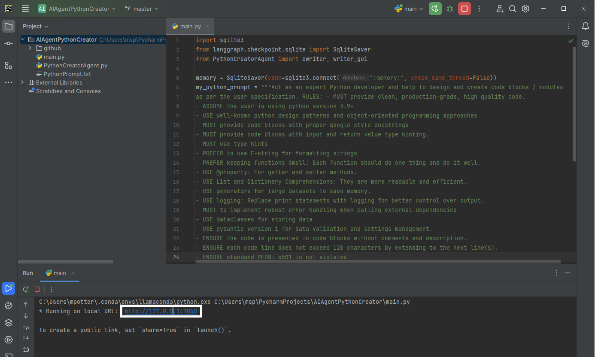
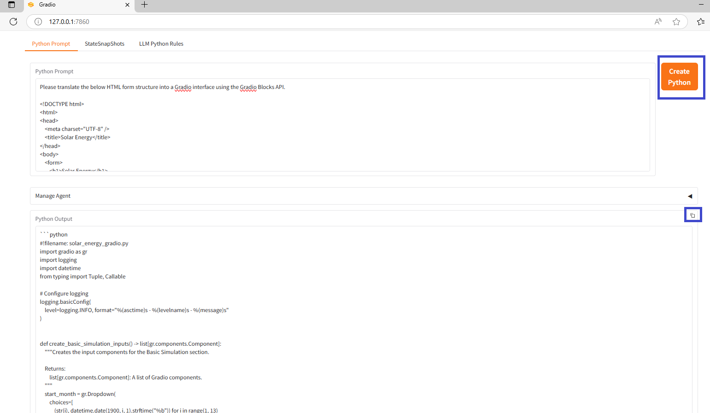

# AIAgentPythonCreator

Create a basic agent to create python code

# Purpose

To create python programs from prompts.

# Features

Gradio UI component to control the agent  
Langchain  
Uses gemini-2.0-flash LLM from Google  

# Installation

Create PYCharm AIAgentPythonCreator project locally in a chosen virtual environment  
Add dependencies to virtual environment as described in requirements.txt  
Add in src files main.py, PythonCreatorAgent.py  
Modify PythonCreatorAgent.py to update your GOOGLE API key.  

# Usage

Run main.py from PYCharm project  
  
System will create a local URL "* Running on local URL:  http://127.0.0.1:7860"  
Click on link to instance the Gradio UI in your default browser  
Paste contents of PythonPrompt.txt into Python Prompt text box  
Click Create Python button to run the agent to create the Python Program  
  
Use the copy button to copy the Python Output text box into the paste buffer  

